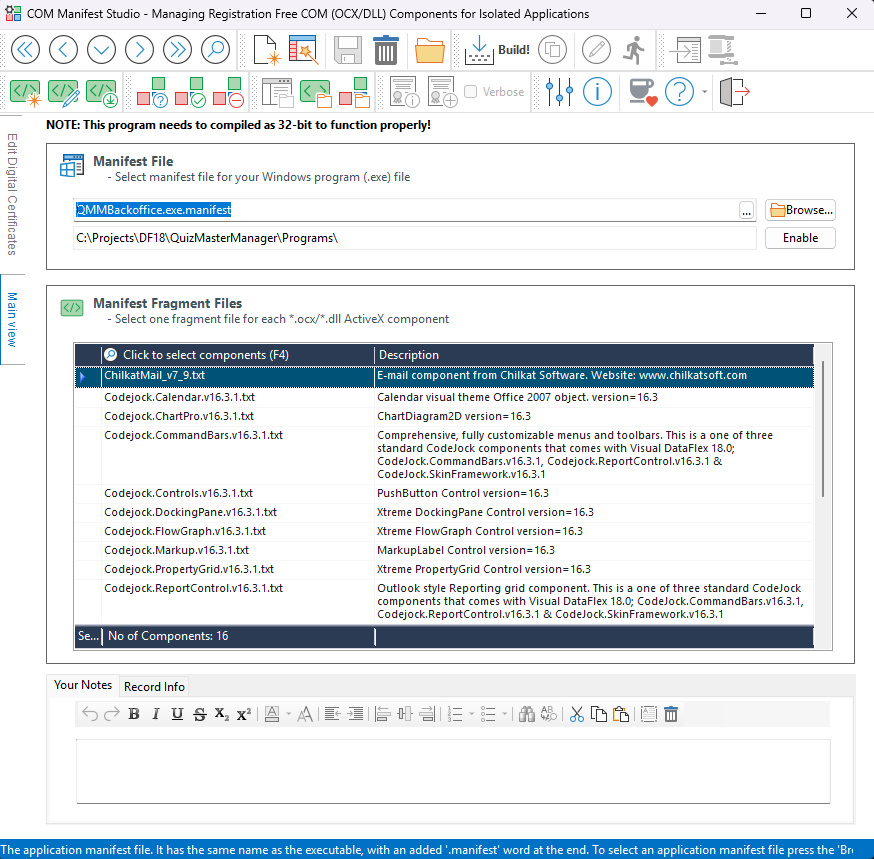

**COM Manifest Studio**

**Program Purpose:**

COMManifestStudio is a specialized tool designed for the efficient management of Registration-Free Component Object Model (COM) components, specifically OCX and DLL files, which are used in isolated applications. The primary function of this software is to create .manifest project files tailored for selected COM/DLL components. This tool is developed using DataFlex, a highly efficient programming language known for its data handling capabilities.

**Important Note:** Compiling the program as a 32-bit application is crucial. Failure to do so may lead to ineffective communication with the COM components, resulting in errors or malfunctions in the application. Ensuring that the correct compilation settings are in place will promote smooth operation and prevent potential issues.

The workspace of COMManifestStudio leverages various additional libraries that are hosted on [NilsSve's GitHub page](https://github.com/NilsSve). Users need not worry about managing these libraries manually, as they are incorporated as Git submodules within the repository. When the repository is cloned, the necessary libraries will automatically be included, simplifying the setup process and ensuring that all dependencies are properly managed. This design choice enhances user experience by streamlining the installation and setup of the tool.
