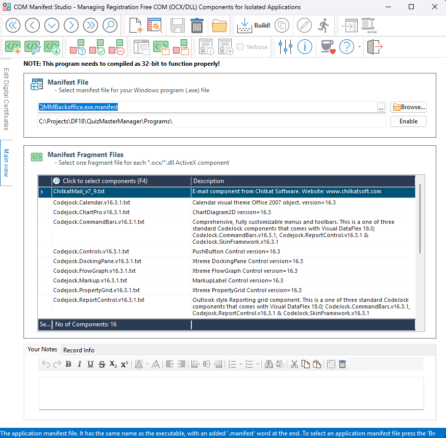

**COM Manifest Studio**

**Program Purpose:**

COMManifestStudio is a specialized tool designed for the efficient management of Registration-Free Component Object Model (COM) components, specifically OCX and DLL files, which are used in isolated applications. The primary function of this software is to create .manifest project files tailored for selected COM/DLL components. This tool is developed using DataFlex, a highly efficient programming language known for its data handling capabilities.

**Important Note:** Compiling the program as a 32-bit application is crucial. Failure to do so may lead to ineffective communication with the COM components, resulting in errors or malfunctions in the application. Ensuring that the correct compilation settings are in place will promote smooth operation and prevent potential issues.

The workspace of COMManifestStudio leverages various additional libraries that are hosted on [NilsSve's GitHub page](https://github.com/NilsSve). You do not need to manage them by hand — `setup.bat` fetches them for you, as described below.

## Setup after cloning

The libraries this workspace uses (Filesystem, DUF, DFAbout, RDCToolsLib, vwin32fh)
are **not** stored in this repository (they are gitignored). Run **`setup.bat`** once from the
repository root and it provides them, behaving differently by machine so one arrangement serves
both maintainer and user:

- On a machine with the shared RDC library pool next door (a sibling `..\Libraries` carrying the
  marker file `.rdc-library-pool`), it makes `Libraries\` a **junction** to that pool — one shared,
  editable copy of every library.
- Otherwise it **clones** the six libraries into this workspace's own `Libraries\` folder:
  isolated, self-contained, and it never writes anywhere outside this workspace. (DUF comes from
  the current `Library-DUF` repo; the old `DbUpdateFramework` repo is superseded by it.)

It also runs `skip-local-data.cmd` so your local `Data\` database changes stay on your machine.
Either way `Libraries\` is local-only and never committed — re-run `setup.bat` any time it looks
missing or out of date. (Because `Libraries\` may be a junction, do not run `git clean -x` here.)
